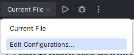
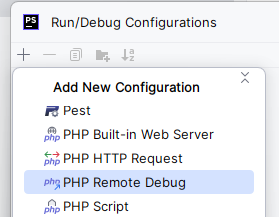
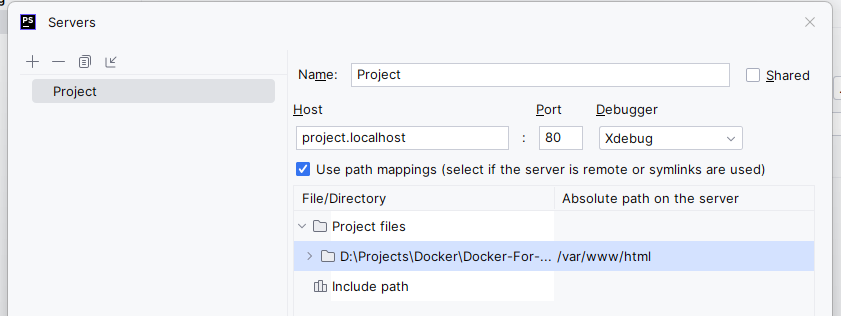
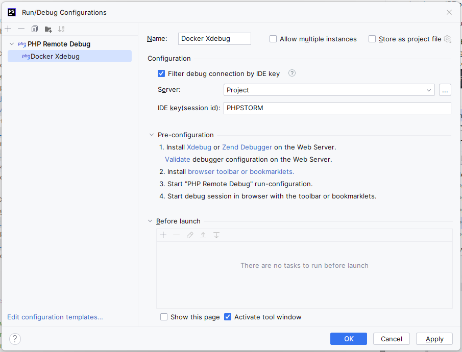
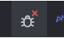
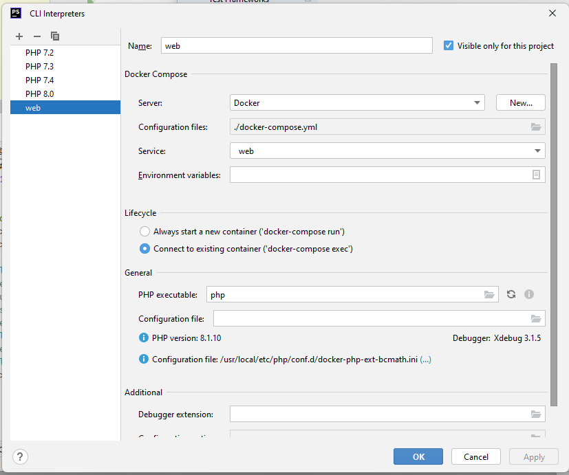
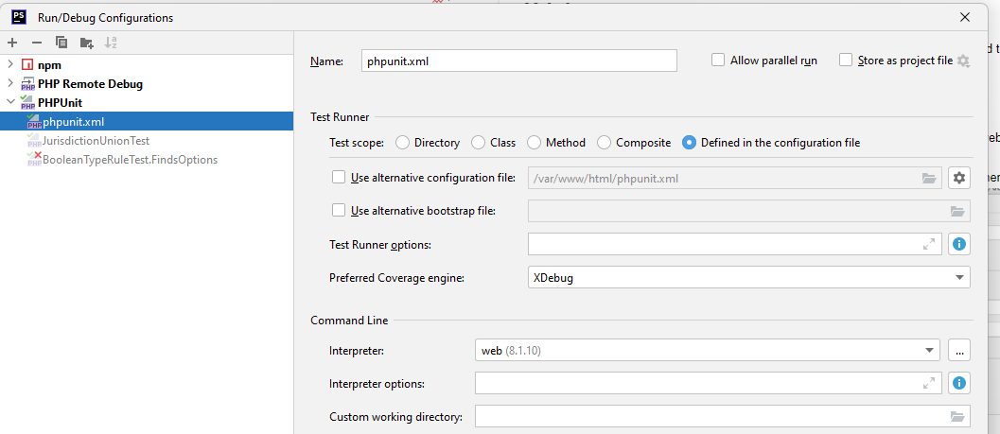

# docker-for-wp-nginx

This Docker repository is built to be used by [Web Whales](https://webwhales.nl) developers to develop WordPress websites, but any other developer may use our repository as well.

## Using this image

When you're about to use this image, you can use the files you'll find in the templates folder in [the repository on GitHub](https://github.com/WebWhales/docker-for-wp-nginx).

When using our template files, follow these steps to start using this image:
* Copy all files under `/templates` to the root of your project directory
* In the `docker-compose.yml`:
  * Change container names when using multiple docker set ups simultaneously
  * Change the `hostname` directives
    * Tip: the *.localhost tld points to your local machine automatically on Windows
  * Change ports when necessary
  * Change the database details and/or root password when necessary
    * The database root password is used by phpMyAdmin
    * When you change the database user, make sure to also change it in the `.docker/conf/mysql/docker-entrypoint-initdb.d/create_test_database.sql` file
* Run `docker-compose up -d` from the root of your project directory to start the containers
* Run `docker-compose exec web bash` from the root of your project directory to SSH into the web container

## Xdebug

The web container contains Xdebug. It should work out of the box, but you might need to set up some settings in your
IDE or browser.

To use Xdebug in your browser:
* Download a Xdebug browser extension ([example](https://chrome.google.
  com/webstore/detail/xdebug-helper/eadndfjplgieldjbigjakmdgkmoaaaoc));
* Set up a "PHP Remote Debug" configuration in the "Run/Debug Configuration" menu;
  1. 
  2. 
  3. Set up a new server if it doesn't exist yet:
     
  4. Configure the PHP Remote Debug configuration for Xdebug:
     
* Activate the "Start listenig for PHP Debug Connections" toggle;

  
* Set some breakpoints in the code and browse to the website.

To use Xdebug with PHPUnit:
* Configure the PHP interpreter to use the web container;
  
* Set up a "PHPUnit" configuration in the "Run/Debug Configuration" menu;
  
* Set some breakpoints in the code and run a test using the "Run Test" buttons on test class or test method level.

### Bonus: some tips to help you on your way

* There are some helpful NGINX config snippets available. You can find them in the `/config/nginx/snippets/` folder within the repository.
* The `web` container contains the following command line tools:
  * `composer`
  * `nano`
  * `nodejs`, `npm`, `n` and `yarn`
  * `gulp` and `gulp-cli`
  * `phpunit`
  * `supervisor`
* Files you put in the `.docker/data/phpmyadmin/uploads` folder become available for importing within phpMyAdmin
